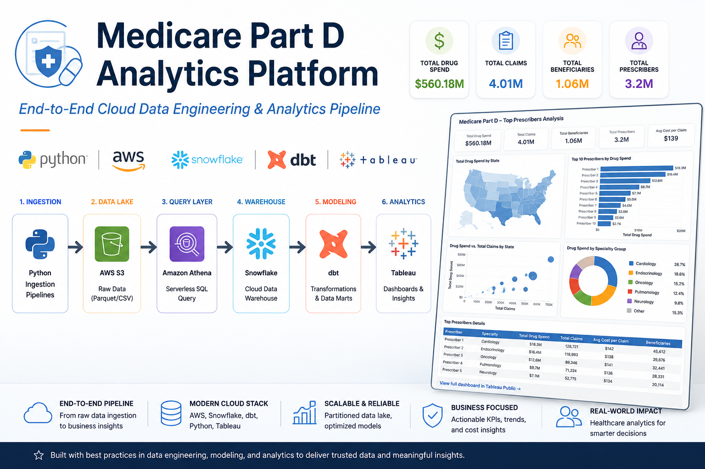
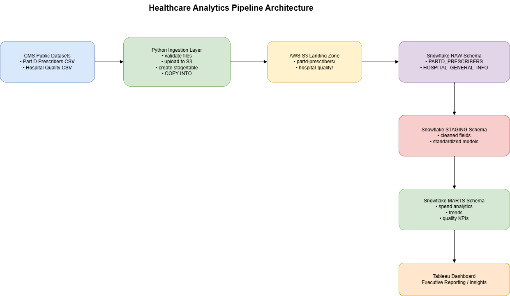

# Medicare Part D Analytics Platform




End-to-end cloud data engineering and analytics pipeline using Python, AWS, Snowflake, dbt, and Tableau.

Production-style healthcare analytics platform built with a modern cloud data stack:

**Python → AWS S3 → Snowflake → dbt → Tableau**

[Live Dashboard (Tableau Public)](https://public.tableau.com/app/profile/lucianarocha/vizzes) 
---

Transforming real CMS Medicare Part D data into scalable, analytics-ready insights.

This project simulates a real-world data platform used by healthcare and analytics teams to:

- Analyze drug spend across the United States
- Understand prescriber behavior and specialty trends
- Identify high-cost providers and optimization opportunities
- Deliver executive-ready dashboards

---


## 🚀 What This Project Demonstrates

This project is designed to reflect real-world data engineering and analytics workflows, focusing on production-style patterns rather than isolated tasks.

### End-to-End Data Pipeline
- Designed and implemented a complete pipeline from raw CMS data to business-ready dashboards
- Orchestrated data flow across Python, AWS S3, Snowflake, dbt, and Tableau

### Scalable Data Lake Architecture
- Built a partitioned AWS S3 data lake using year-based structure
- Implemented compressed storage (.csv.gz) for performance and cost optimization

### Production-Ready Ingestion Patterns
- Developed parameterized ingestion pipeline supporting multi-year data loads
- Ensured idempotent execution (safe re-runs without duplication)
- Automated metadata enrichment using `REPORT_YEAR`

### Modern Data Modeling (dbt)
- Applied dimensional modeling (fact + dimensions) for analytics use cases
- Structured transformations into staging, analytics, and mart layers
- Prepared models for testing, documentation, and scalability

### Cloud Data Warehouse Design (Snowflake)
- Separated storage and compute for efficient processing
- Designed RAW → STAGING → ANALYTICS → MART layers
- Optimized for large-scale analytical queries

### Business-Focused Analytics
- Translated raw healthcare data into meaningful insights
- Built datasets to support executive dashboards and decision-making
- Focused on real use cases: drug spend, provider behavior, and cost trends

## 🏗️ Architecture
> Designed using production data engineering patterns: decoupled storage, scalable compute, and modular transformations.



This platform follows a modern cloud data architecture pattern, separating ingestion, storage, transformation, and analytics layers.

### Data Flow Overview

1. **Source Data (CMS Medicare Part D)**
   - Raw healthcare data ingested from public CMS datasets

2. **Ingestion Layer (Python)**
   - Validates source files
   - Adds metadata (`REPORT_YEAR`)
   - Compresses data to `.csv.gz`
   - Uploads to AWS S3

3. **Cloud Storage (AWS S3)**
   - Partitioned data lake (`year=YYYY`)
   - Optimized for scalable storage and downstream processing

4. **Query Layer (Amazon Athena)**
   - Enables direct querying and validation of raw data in S3
   - Supports partition repair and schema checks

5. **Data Warehouse (Snowflake)**
   - External stage connected to S3
   - RAW layer stores ingested data
   - Scalable compute for transformations and analytics

6. **Transformation Layer (dbt)**
   - Staging models for cleaning and standardization
   - Dimensional modeling (facts and dimensions)
   - Data marts for business use cases

7. **Visualization Layer (Tableau)**
   - Interactive dashboards for business insights
   - Executive-ready analytics and reporting

## 📊 Business Context & Use Case

Healthcare organizations and analytics teams rely on large-scale data platforms to monitor cost, utilization, and provider behavior.

This project simulates a real-world analytics environment focused on **Medicare Part D prescription data**, enabling stakeholders to answer critical business questions.

### Key Questions Answered

- Which states drive the highest Medicare drug spend?
- Which medical specialties generate the most prescription volume?
- Who are the highest-cost prescribers in the system?
- How does drug spending evolve year over year?
- What is the impact of brand vs. generic drug usage?

### Business Impact

The platform transforms raw healthcare data into structured insights that support:

- **Cost optimization** initiatives across regions and providers  
- **Policy and compliance analysis** in public healthcare systems  
- **Operational decision-making** for healthcare organizations  
- **Executive reporting** through interactive dashboards  

### Why This Matters

Healthcare data is complex, high-volume, and critical for decision-making.

This project demonstrates how to convert raw, multi-year datasets into a scalable analytics platform that delivers **actionable insights**, not just data.

## 🧱 Data Model
> Designed following Kimball-style dimensional modeling principles.
The platform follows a **dimensional modeling approach (star schema)** optimized for analytical queries and dashboard performance.

### Fact Table

- **fct_partd_prescriptions**
  - **Grain:** One record per **Prescriber + Drug + Year**
  - **Purpose:** Central table capturing prescription activity and financial metrics

**Key Measures:**
- Total Claims (`tot_clms`)
- Total Beneficiaries (`tot_benes`)
- Total Drug Cost (`tot_drug_cst`)
- Total Day Supply (`tot_day_suply`)

---

### Dimension Tables

- **dim_prescriber**
  - Prescriber identifier (NPI)
  - Provider name and attributes

- **dim_drug**
  - Brand name
  - Generic name

- **dim_geography**
  - State and regional attributes

- **dim_specialty**
  - Provider specialty classification

---

### Modeling Strategy

- Separate **facts and dimensions** to enable flexible aggregation
- Designed for **high-performance analytical queries**
- Supports **multi-dimensional slicing** (state, specialty, drug, year)
- Built to scale with additional years and datasets

---

### Data Flow into the Model

- RAW layer stores ingested CMS data
- STAGING layer standardizes and cleans fields
- ANALYTICS layer builds reusable dimensions and fact tables
- MARTS layer delivers aggregated datasets for dashboards

---

### Why This Design

This structure enables:

- Fast aggregation for large datasets (millions of rows)
- Clear separation between raw data and business logic
- Reusability across multiple dashboards and use cases
- Alignment with industry-standard data warehouse practices

## ⚙️ Tech Stack

| Layer | Tool | Purpose |
|---|---|---|
| Data Source | CMS Medicare Part D | Real public healthcare dataset |
| Ingestion | Python, pandas | File validation, metadata enrichment, compression |
| Cloud Storage | AWS S3 | Partitioned raw data lake |
| Query Validation | Amazon Athena | Raw data validation over S3 |
| Data Warehouse | Snowflake | Scalable storage and analytical compute |
| Transformation | dbt | Staging, dimensional modeling, data marts, tests |
| Visualization | Tableau Public | Interactive dashboards and executive reporting |
| Version Control | GitHub | Code, documentation, and project history |


## 📈 Key Metrics & Scale

This project processes real-world healthcare data at meaningful scale, reflecting production-style data workloads.

- **26.7M+ rows** loaded into Snowflake  
- **3.6 GB** raw CMS dataset  
- **~700 MB** compressed cloud storage (.csv.gz)  
- **3 years of data** (2021–2023)  
- **Multi-year ingestion architecture** with parameterized loads  
- **Partitioned data lake** structure in AWS S3 (`year=YYYY`)  

---

### Performance & Design Considerations

- Reduced storage footprint using compression (~80% reduction)
- Optimized query performance through dimensional modeling
- Enabled scalable ingestion through year-based partitioning
- Designed for efficient reprocessing and incremental expansion

## 📊 Dashboards

Interactive dashboards built in Tableau to translate raw healthcare data into business insights.

👉 **Live Dashboards:**
- [Drug Spend by State](https://public.tableau.com/app/profile/lucianarocha/viz/MedicarePartDDrugSpendbyState/Dash-drug_spend_by_state)
- [Specialty Summary](https://public.tableau.com/app/profile/lucianarocha/viz/mart_specialty_summary/mart_specialty_summary)

---

### Drug Spend by State

Analyzes total Medicare Part D drug spending across U.S. states.

**Highlights:**
- Geographic distribution of drug costs
- Year-over-year spend trends
- Identification of high-cost regions

---

### Specialty Summary

Provides insights into prescription activity by medical specialty.

**Highlights:**
- Total claims and beneficiaries by specialty
- Average cost per claim
- Specialty-level performance comparison
- KPI-driven overview for quick analysis

---

### Top Prescribers *(Planned)*

Identifies providers with the highest prescription volume and cost.

**Planned insights:**
- Top providers by total drug spend
- Ranking by total claims and beneficiaries
- High-impact prescriber segmentation

---

### Brand vs Generic Analysis *(Planned)*

Evaluates cost differences between brand-name and generic drugs.

**Planned insights:**
- Cost distribution by drug type
- Trends in generic adoption
- Potential cost-saving opportunities

---

### Dashboard Features

- Interactive filters (year, state, specialty)
- KPI-driven summaries
- Drill-down capabilities
- Designed for executive-level consumption


## How to Run the Ingestion Pipeline

### Prerequisites

- Python 3.9+
- AWS account with S3 access
- S3 bucket created in `us-west-2`
- Snowflake account
- Local CMS Part D source files downloaded
- Credentials configured in `.env`

---

### Environment Variables

```env
AWS_ACCESS_KEY_ID=your_key
AWS_SECRET_ACCESS_KEY=your_secret
AWS_REGION=us-west-2
S3_BUCKET_NAME=medicare-partd-analytics

SNOWFLAKE_ACCOUNT=your_account
SNOWFLAKE_USER=your_user
SNOWFLAKE_PASSWORD=your_password
SNOWFLAKE_WAREHOUSE=COMPUTE_WH
SNOWFLAKE_DATABASE=HEALTHCARE_DB
SNOWFLAKE_SCHEMA=RAW
SNOWFLAKE_ROLE=SYSADMIN

LOCAL_FILE_PATH=data
```

### Install Dependencies

```bash
pip install -r ingestion/requirements.txt
```

### Run Pipeline

Load a specific Medicare Part D report year using the `--year` parameter:

```bash
python ingestion/ingest_partd.py --year 2023
python ingestion/ingest_partd.py --year 2022
python ingestion/ingest_partd.py --year 2021
```

### What Happens Automatically
For the selected year, the pipeline will:

- Validate the local source file
- Add REPORT_YEAR metadata column
- Compress the file to .csv.gz
- Upload to partitioned AWS S3 path
- Repair Athena partitions
- Load Snowflake RAW table
- Replace existing rows for that year
- Validate row counts

---

## Ingestion Layer

The ingestion layer is a production-style Python pipeline designed to onboard **multi-year CMS Medicare Part D datasets** into Snowflake through AWS S3.

The pipeline supports parameterized yearly loads, metadata enrichment, compression, and cloud partitioning.

### Current Supported Dataset

| Dataset | Source File Pattern | RAW Target Table |
|---|---|---|
| Medicare Part D Prescribers | `partd_prescribers_<year>.csv` | `RAW.PARTD_PRESCRIBERS` |

### Example Source Files

```text
data/partd_prescribers_2021.csv
data/partd_prescribers_2022.csv
data/partd_prescribers_2023.csv
```

### Final S3 Cloud Objects
- raw/year=2021/partd_prescribers_2021.csv.gz
- raw/year=2022/partd_prescribers_2022.csv.gz
- raw/year=2023/partd_prescribers_2023.csv.gz


### Why This Layer Exists

Healthcare analytics teams often receive large yearly flat files.

This ingestion layer standardizes onboarding by automating:

- Local file validation
- Year-based file selection
- Metadata enrichment with REPORT_YEAR
- Compression to .csv.gz
- Secure upload to AWS S3
- Athena partition refresh
- Snowflake RAW loading
- Safe yearly reload logic
- Row count validation

### Dynamic Year Selection

The script uses a command-line parameter to select which Medicare Part D report year to process.

### Example

```bash
python ingestion/ingest_partd.py --year 2023
python ingestion/ingest_partd.py --year 2022
python ingestion/ingest_partd.py --year 2021
```
### This Automatically Controls
- Source filename
- Local file lookup
- REPORT_YEAR metadata column
- Temporary compressed file name
- S3 partition destination
- Snowflake stage source path
- Year-specific delete/reload logic
- Validation row counts

### This Automatically Controls
For:

```bash
python ingestion/ingest_partd.py --year 2023
```
The pipeline resolves to:

```bash
Source File: partd_prescribers_2023.csv
S3 Folder: raw/year=2023/
Cloud File: partd_prescribers_2023.csv.gz
Target Rows: REPORT_YEAR = 2023
```

### Example Execution Flags

The pipeline uses runtime flags inside `main()` to control which steps execute.

```python
RUN_ADD_REPORT_YEAR_AND_COMPRESS = True
RUN_UPLOAD_TO_S3 = True
RUN_REPAIR_ATHENA = True

RUN_CREATE_INFRASTRUCTURE = False
RUN_SNOWFLAKE_TEST = False
RUN_CREATE_STAGE = False
RUN_CREATE_RAW_TABLE = False
RUN_COPY_INTO = False
```

### Example Workflow

    CMS CSV File
       ↓
    Python Validation
       ↓
    AWS S3 Landing Zone
       ↓
    Snowflake External Stage
       ↓
    RAW Table Load (COPY INTO)
       ↓
    Validation Checks

### Why It Matters

This project demonstrates production-style ingestion patterns used in modern data engineering environments:

- Parameterized multi-year pipeline design
- Repeatable yearly data onboarding
- Large-file processing with chunked pandas workflows
- Automated metadata enrichment (`REPORT_YEAR`)
- Compressed cloud storage optimization (`.csv.gz`)
- Partitioned AWS S3 data lake architecture
- Athena integration for raw data validation
- Snowflake warehouse automation
- Safe delete-and-reload year processing
- Scalable foundation for future annual CMS data loads

---

## 🎯 Why This Project Matters

Many portfolio projects rely on small or synthetic datasets and focus only on isolated tools.

This project takes a different approach.

It uses **real CMS healthcare data** and applies production-style data engineering and analytics patterns to simulate how modern data platforms are built and used in practice.

### What Makes This Project Different

- Built on **real-world healthcare data**, not toy datasets  
- Designed as a **complete analytics platform**, not a single script or dashboard  
- Applies **production patterns** such as partitioned data lakes, idempotent pipelines, and layered modeling  
- Focused on **business outcomes**, not just technical implementation  

### Real-World Relevance

The architecture and design decisions in this project reflect challenges faced by:

- Healthcare and pharma analytics teams  
- Data engineering and analytics engineering teams  
- Organizations working with large-scale public datasets  

### Outcome

This project demonstrates the ability to:

- Design scalable data pipelines  
- Model data for analytical performance  
- Translate raw data into business insights  
- Build systems aligned with real production environments

## 👤 About Me

Data professional specializing in **cloud data engineering and analytics**, with a strong focus on building scalable, production-style data platforms.

- **15+ years** in Business Intelligence and Analytics  
- Experience with **AWS, Snowflake, SQL, and Python**  
- Background in **healthcare and pharma analytics**  
- Focused on modern data stack: ingestion, modeling, and analytics  

---

### What I Bring

- End-to-end thinking: from raw data ingestion to business insights  
- Strong foundation in data modeling and analytics design  
- Experience working with large-scale, real-world datasets  
- Ability to translate technical solutions into business value  

---

### Current Focus

- Building cloud-native analytics platforms  
- Advancing in **Analytics Engineering and Data Engineering** roles  
- Expanding expertise in **Snowflake, dbt, and modern data workflows**  

---

📫 Connect with me on [LinkedIn](https://www.linkedin.com/in/luciana-ferreira-da-rocha/) • [GitHub](https://github.com/LucianaRocha)


*Repository under active development. Last updated: April 28, 2026.*
